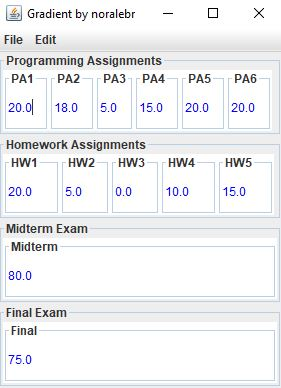

# Gradient
Grading program to display and calculates the final grade for a student by reading a file. It also interactively builds GUI depending of the contents of the file.

The format of the .grd file that it reads to display the grades is in the files package in the project.
The are some file examples in the project.

The program has to be run with a **command argument**, which is the **absolute path** to the .grd to be read.

